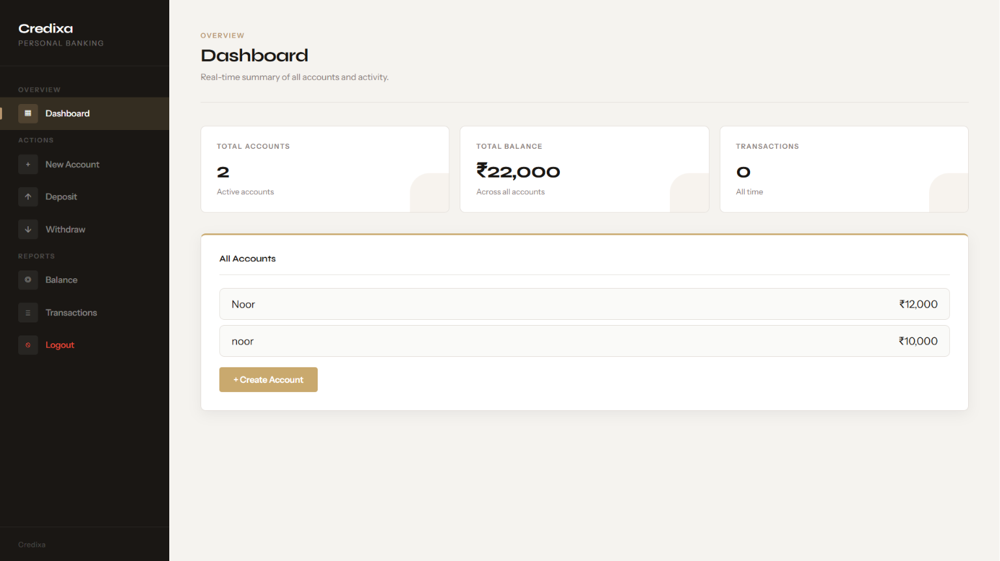

<div align="center">

<br />



<br />
<br />

# Credixa

**A modern Bank Management System built with HTML, CSS, JavaScript and Supabase**

<p>
  <a href="https://bank-management-system-ldfz.onrender.com">
    
  </a>
  &nbsp;
  <a href="https://github.com/PriyankaChoudhary9877/bank-management-system">
    
  </a>
</p>

<p>
  
  
  
  
  
  
</p>

</div>

---

## Overview

Credixa is a responsive web-based Bank Management System that allows users to securely manage their bank accounts online. It provides authentication, account creation, deposits, withdrawals, balance inquiry, and transaction history — all through a clean banking dashboard.

Built using HTML, CSS, JavaScript, and Supabase, Credixa demonstrates modern web application development with cloud-based authentication, PostgreSQL database integration, and a responsive user interface.

---

## Highlights

- Secure user authentication using Supabase
- Cloud-based PostgreSQL database for real-time data storage
- Responsive banking dashboard with a clean, modern UI
- Real-time account and transaction management
- Built with HTML, CSS, and JavaScript — no backend framework required

---

## Screenshots

<table>
  <tr>
    <td align="center" width="50%">
      <b>Dashboard</b><br /><br />
      
    </td>
    <td align="center" width="50%">
      <b>Create Account</b><br /><br />
      
    </td>
  </tr>
  <tr>
    <td align="center" width="50%">
      <b>Deposit Money</b><br /><br />
      
    </td>
    <td align="center" width="50%">
      <b>Withdraw Money</b><br /><br />
      
    </td>
  </tr>
</table>

<details>
<summary><b>More Screenshots</b></summary>

<br />

**Authentication**

<table align="center">
  <tr>
    <td align="center"><b>Login Page</b><br /><br /></td>
    <td align="center"><b>Register Page</b><br /><br /></td>
  </tr>
</table>

<br />

**Account Created**

<p align="center">
  
</p>

**Balance Inquiry**

<p align="center">
  
</p>

**Transaction History**

<p align="center">
  
</p>

**Particular Transaction History**

<p align="center">
  
</p>

</details>

---

## Features

| Feature | Description |
|---|---|
| Secure Authentication | User registration, login, and logout via Supabase Authentication |
| Personal Dashboard | View account statistics, total balance, and recent activity |
| Create Bank Account | Open a new bank account with an initial deposit |
| Deposit Money | Add funds to any existing account |
| Withdraw Money | Prevents withdrawals when the account has insufficient balance |
| Balance Inquiry | Check the real-time balance of any account |
| Transaction History | Track all deposits and withdrawals with timestamps |
| Particular Transaction History | View detailed transaction records per account |
| Delete Account | Remove an existing bank account |
| Cloud Database | Accounts and transactions stored securely in Supabase PostgreSQL |
| Responsive Web Interface | Modern banking interface optimized for desktop and mobile |

---

## Tech Stack

<table>
  <tr>
    <td valign="top" width="25%">
      <b>Frontend</b><br /><br />
      <br />
      <br />
      
    </td>
    <td valign="top" width="25%">
      <b>Backend & Auth</b><br /><br />
      <br />
      
    </td>
    <td valign="top" width="25%">
      <b>Database</b><br /><br />
      
    </td>
    <td valign="top" width="25%">
      <b>Deployment</b><br /><br />
      <br />
      <br />
      
    </td>
  </tr>
</table>

---

## Database Schema

### `accounts`

| Column | Type |
|---|---|
| accnum | bigint |
| name | text |
| balance | numeric |
| user_id | uuid |

### `transactions`

| Column | Type |
|---|---|
| id | bigint |
| accnum | bigint |
| description | text |
| amount | numeric |
| type | text |
| date | text |
| user_id | uuid |

---

## Getting Started

<details>
<summary><b>Prerequisites</b></summary>

<br />

- A modern web browser
- A Supabase account and project
- Render account (optional, for deployment)

</details>

<details open>
<summary><b>Installation</b></summary>

<br />

**1. Clone the repository**

```bash
git clone https://github.com/PriyankaChoudhary9877/bank-management-system.git
cd bank-management-system
```

**2. Set up Supabase**

- Create a new Supabase project
- Create the `accounts` and `transactions` tables using the schema above
- Enable Email/Password authentication in the Supabase dashboard

**3. Configure Supabase keys**

Replace the placeholder values in your JavaScript files:

```javascript
const SUPABASE_URL = "YOUR_SUPABASE_URL";
const SUPABASE_ANON_KEY = "YOUR_SUPABASE_ANON_KEY";
```

**4. Run the project**

Open `login.html` directly in your browser, or deploy to Render.

</details>

---

## Project Structure

```
bank-management-system/
│
├── index.html                 # Dashboard
├── login.html                 # Login Page
├── register.html              # Registration Page
├── README.md
│
└── public/                    # Screenshots
```

---

## Future Enhancements

- Money Transfer Between Users
- User Profile Management
- Email Notifications
- Monthly Statement Download (PDF)
- Search Transactions
- Dark Mode
- Admin Dashboard
- Interest Calculator
- Loan Management
- QR Payment Support

---

## Author

<table>
  <tr>
    <td align="center">
      <b>Priyanka Choudhary</b><br />
      Computer Science Engineering Student<br /><br />
      <a href="https://github.com/PriyankaChoudhary9877">
        
      </a>
      &nbsp;
      <a href="https://www.linkedin.com/in/priyanka-choudhary-58b048312/">
        
      </a>
      &nbsp;
      <a href="https://bank-management-system-ldfz.onrender.com">
        
      </a>
      &nbsp;
      <a href="mailto:priyankachoudhary9877@gmail.com">
        
      </a>
    </td>
  </tr>
</table>

---

## License

This project is intended for educational purposes.

---

<div align="center">

⭐ If you found this project useful, please consider giving it a star on GitHub.

<br />

Designed and developed by Priyanka Choudhary.

</div>
